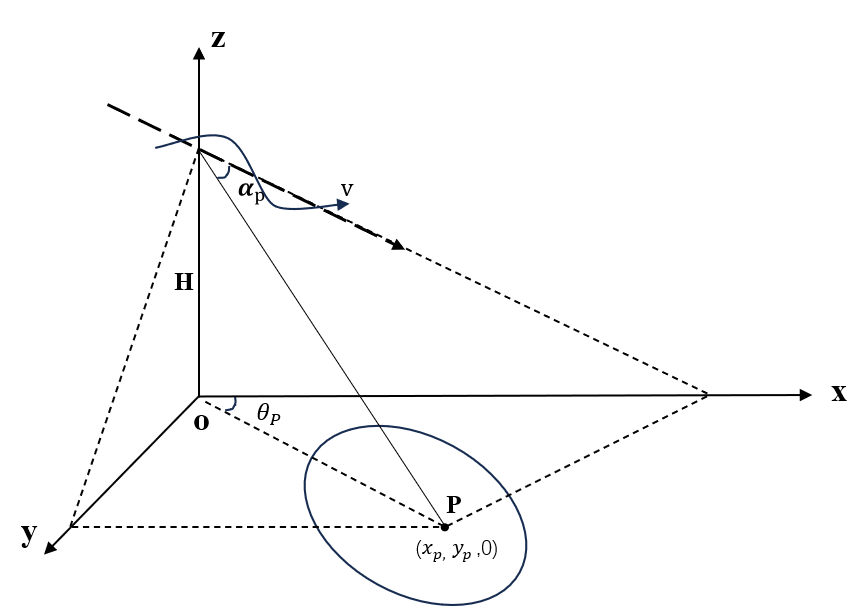

# 😎 **Hi，我是[仰度]！**

> **"雷达🐮🐎，不失灵魂。"**  
> 专注 SAR 的大专生，大斜视轨迹中的打工人。

---

## 🌌 **关于我**

👨‍💻 **研究方向：** SAR（合成孔径雷达）——一个让雷达帮我看清世界的领域，却让我看不清自己的头发为什么越来越少。  
🔍 **身份：** 在读本科生。  
🎯 **日常：** 和 MATLAB、Python 做朋友，和 C 做敌人。

### SAR高机动曲线轨迹模型

---

## 🤖 **我是个什么🐮🐎？**

🌟 **曾经的我：**  

🌟 **现在的我：**  

🌟 **未来的我：**  

---

## 🛠 **我的技能清单（非常主观）**

> 以下技能评分请直接无视，因为科研人的自我认知不稳定...

---

## 🤡 **我的雷达科研生活**

**🎯 经历：**  
- 成像得到了目标，但没得到快乐。  

**🏆 成就：**  

**📜 日常真实语录：**  
- **“又出鬼画符了，重来！”**  
- **“数据没问题，是我问题！”**
- **。。。”** 
- **！！！”**
- **？？？”** 

---

## 🐯 **标签：关于我的一些无用信息**

- 🚀  
- ☕ 
- 🌍
- 🎮

---

## 🎨 **我的科研功力展示（真实而搞笑）**

### 🧰 **奇怪但专业的技能：**

### 📈 **GitHub 数据：**
（别人给的 STAR 数总能让我活一天）

  

---

## 💌 **如何找到我？**

📧 如果你也是科研人，或者也在 SAR 领域里挣扎，欢迎交流或者喊救命：  
- **Email：** 1@020420.com  
- **GitHub：** [@Aquan98](https://github.com/Aquan98)  
- **微信：**  

---
